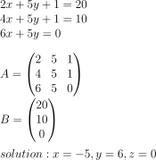
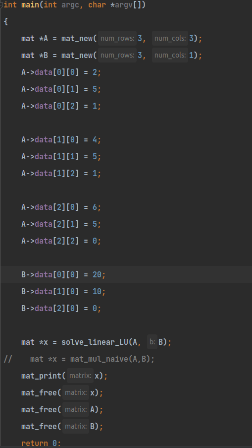
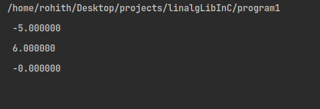

## A Custom linear algebra library
***
 
### About
<p>This project is an attempt to implement whatever I learned during my introductory linear algebra course during my first year of engineering.  </p>

<h3>Problem</h3>


<h4>Input for solving a linear system of equations </h4>

<br>




> If you are a light mode user, checkout the image [here](/images/Math_black.svg)


<br/>
<br/>

<h4>Main function</h4>




<h4>Output</h4>




### What can it do? 
***
- Matrix multiplication 
  - Currently,this is done using the naive O(n^3) algorithm (```mat_mul_naive``` function in the code)
  - The plan is to shift this to strassen's algorithm(```mat_mul_strassen`` function in the code)
- Finding Row Echelon Form of a Matrix
- Finding Reduced Row Echelon Form of a Matrix
- LU decomposition
- Solving linear equations
  - Multiple Implementations of the same
    - ```solve_linear_forward``` using the forward substitution method
    - ```solve_linear_backward``` using the backward substitution method
- Finding the inverse
  - Using LU method
- Finding the determinant
- QR decomposition
 
### How I built it?
***

- I was completely new to C when I started with this project 
- I had done a freshmen introduction to linear algebra so I was kind of familiar with the mathematical concepts 
- References:
  - 3b1b Linear Algebra playlist
  - Linear Algebra playlist from Khan Academy
  - Linear Algebra playlist from MathTheBeautiful
  - The C programming language(Dennis Ritchie and Brian Kernighan)

### Can this be used in production?
***
<p>Definitely not, this project was build for educational purposes only and this is definitely not a library that one should use for their projects</p>

### Future of this project
***
- This project is far from complete
- Some new features to be implemented
  - A CLI interface for users 
  - Replacing current makefile with CMake
  - Adding faster algorithms and better data structures
    - Addition of strassen's algorithm for matrix multiplicaton
    - Dense and sparse matrices
    - More...
 

